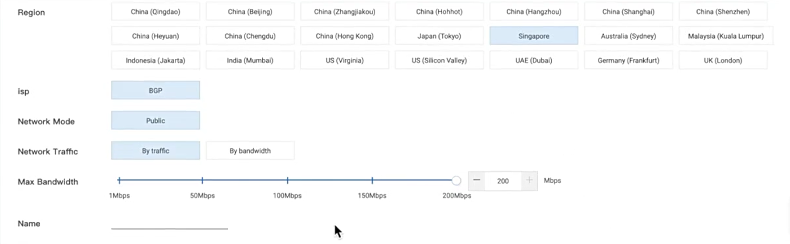

# ECS Fundamental

### 1. Create VPC

- Search VPC, click VPCs on left panel > click create vpc

- Make sure your region, type vpc name

- Select default or custom IPv4 CIDR for VPC

- Select resource group

- Type vSwitch name & select zone > Type IPv4 CIDR > Click add to another vSwitch

- Type another vSwitch name & select zone > Type IPv4 CIDR > Click add to another vSwitch

- Click create

### 2. Create EIP

- Search VPC, click Elastic IP Address on left panel > click create

- Select billing method

- Select region > Select network traffic (by traffic / by bandwidth) > Type name

- Click buy now

### 3. Create ECS

- Search ECS, and click elastic computing

- Click Instances on left panel

- Make sure your region, and click create instance

- Select billing method

- Select region and zone

- Select instance type family

- Select Image > Select OS & version

- Select system disk > Type size disk

- Set default backup period or create new backup schedule > Select data source

- Click Next

- On network type, select VPC & vSwitch (subnet)

- Uncheck if you have an EIP

- If you need to custom security group, click create a security group

- Search ECS, scroll down to find security groups on left panel

- Click create security group

- Type security group name

- Type description > Select security group type > Select VPC for network type > Choose VPC name > Select resource group > Cek inbound rules > click OK

- Select Security group name

- Set default configurations > Click next

- Select logon credential (recommendation : password) > Set logon password > confirm password

- Type instance name > Type hostname

- Set default configurations > Click next

- Select resource group > Set default configurations > Click next

- Create instance

### 4. Bind EIP to Instance

- click EIP name > Click `Bind Resource` button

- Select instance type

- Choose instance & click OK

### 5. SSh Remote Instance

- Open terminal > Type `ssh root@[EIP/public IP instance]` > Type password

### 6. Add Another Inbound rules

- Search ECS, scroll down to find security groups on left panel
- Click security group name
- Click Add security group rule

- Select `Rule Direction`
- Select `Action`
- Select `Protocol Type`
- Select `Port Range & Priority`
- Select `Authorization Object` & Click OK

