# Use OSS to Encrypt Objects

- Client-side encryption
- Server-side encryption

## Lab environment architecture diagram

Client-side encryption

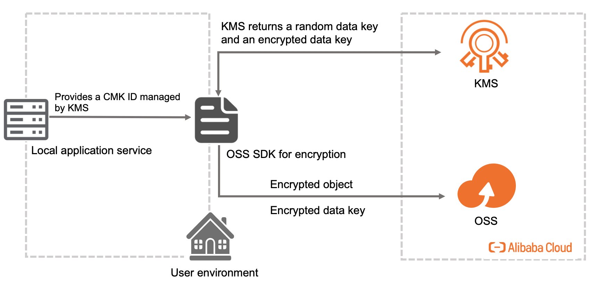

Server-side encryption

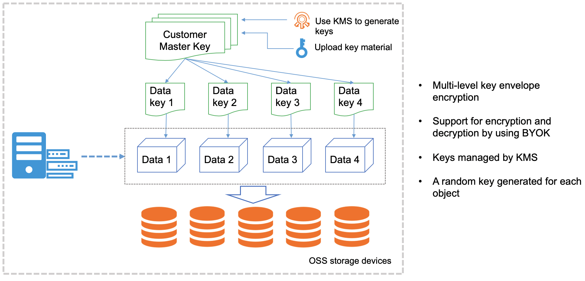

Cloud resources required

- KMS
- ECS
- OSS

### Client-side encryption

1. Encrypt and upload an object

- Obtain a data key: The client uses the specified CMK ID to request a data key from KMS to encrypt the object. KMS returns a random data key and an encrypted data key.

- Encrypt the object and upload the encrypted object to OSS: The client uses the data key that is returned to encrypt the object, and uploads the encrypted object and encrypted data key to OSS.

2. Download and decrypt an object

- Download an object: The client downloads an encrypted object. The encrypted data key is included in the metadata of the object.

- Decrypt the object: The client sends the encrypted data key and the corresponding CMK ID to KMS. KMS uses the CMK specified by the CMK ID to decrypt the encrypted data key and returns the decrypted data key to the client for object decryption.

#### Log on to the ECS instance

Click Elastic Compute Service, as shown in the following figure.


One running ECS instance that is deployed in the US (Silicon Valley) region is displayed.

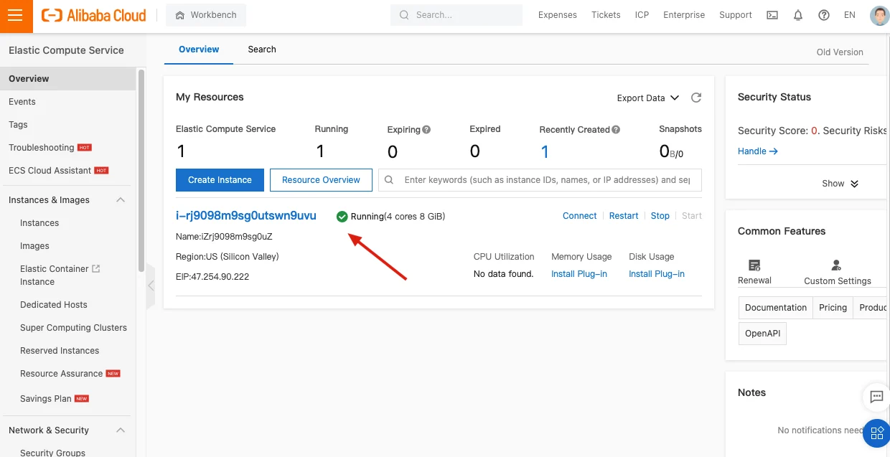

Copy the public IP address of the Ubuntu ECS instance and remotely log on to the ECS instance. For more information, see [How to Remotely Log in to Alibaba Cloud's ECS Server.](https://labex.io/questions/150)

#### Create AccessKey

Click AccessKey Management, as shown in the following figure.

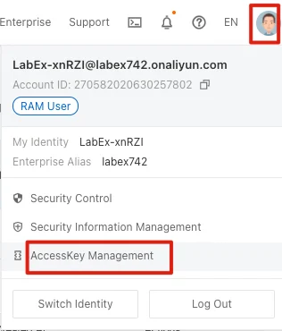

Click Create AccessKey. After AccessKey is successfully created, AccessKeyID and AccessKeySecret are displayed. AccessKeySecret is displayed only once. Click Download CSV File to save the AccessKeySecret.

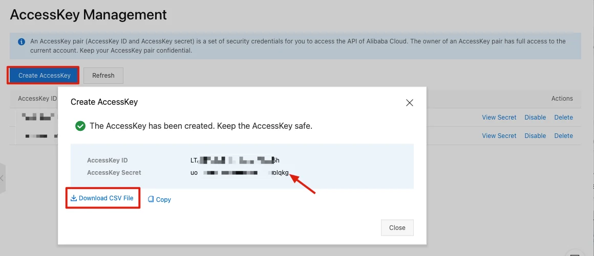

#### View keys in the KMS console

Go to the KMS console, as shown in the following figure.

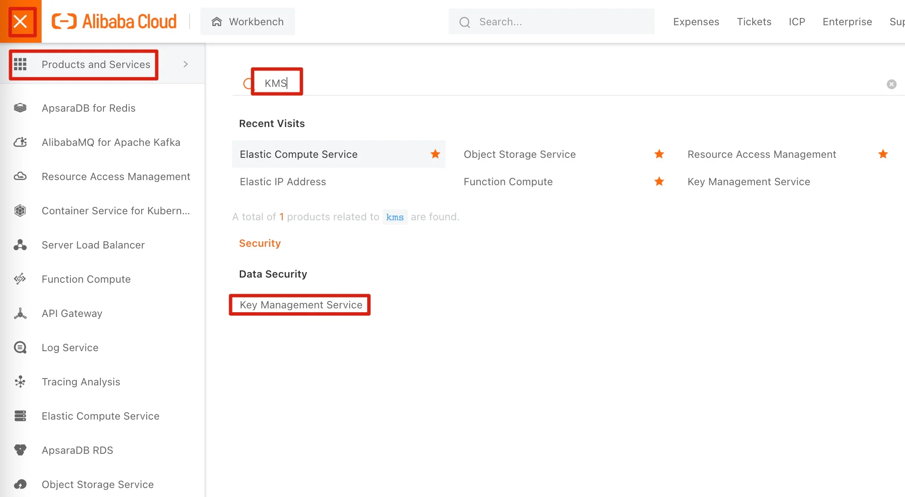

Select the US (Silicon Valley) region. A key whose status is Enabled is displayed.

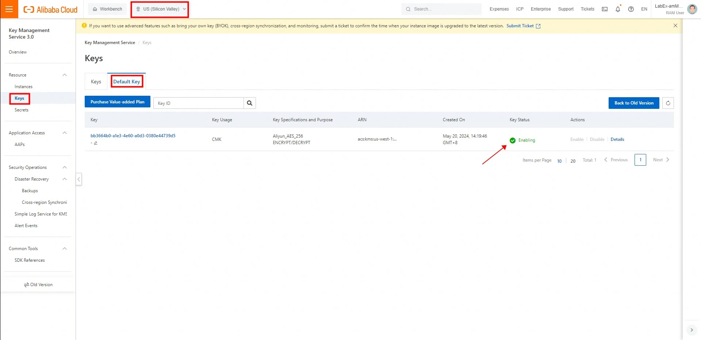

If the user sees one or more keys whose state is "Pending Deletion" (which is normal), please select the key whose status is "Enabled".

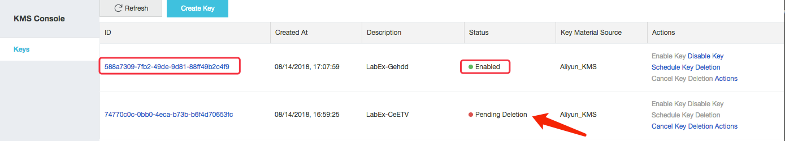

Record the key ID for subsequent operations.

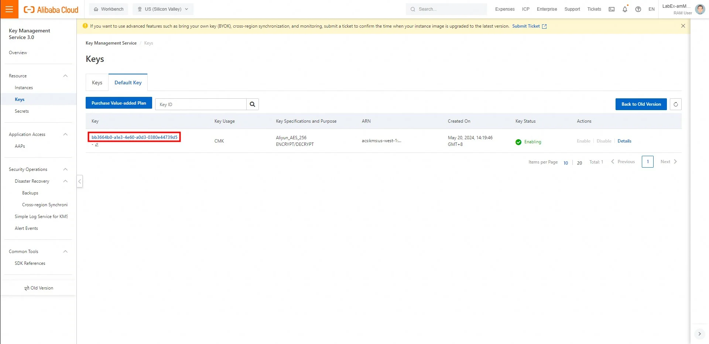

#### View the bucket

Go to the OSS console, as shown in the following figure.

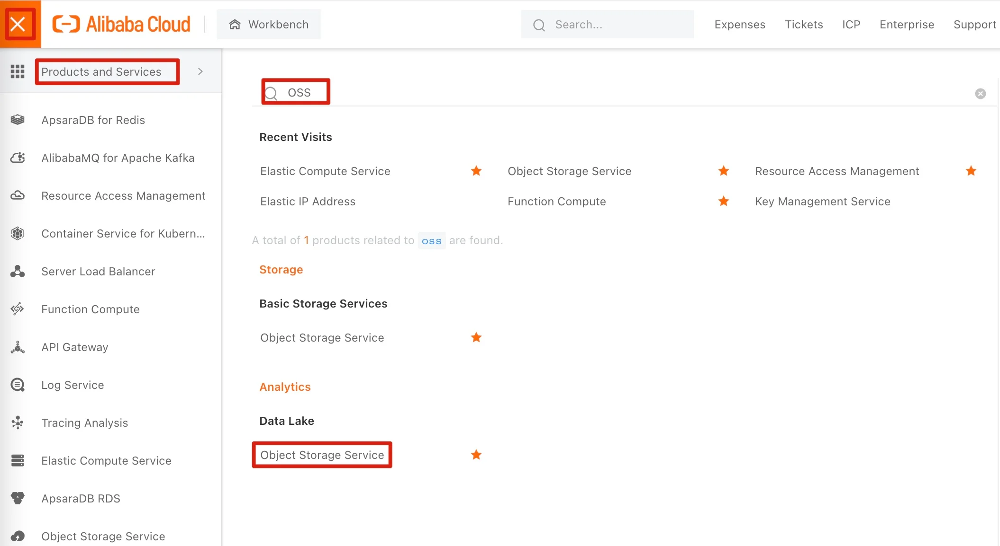

In the OSS console, a bucket that is automatically created is displayed. Record the name of the bucket for subsequent operations.

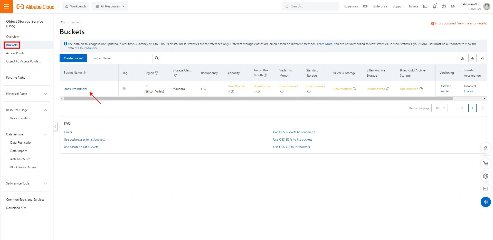

#### Perform encryption tests and decryption tests

Run the following command to install the Python dependency library for OSS:

```bash
pip3 install oss2
```

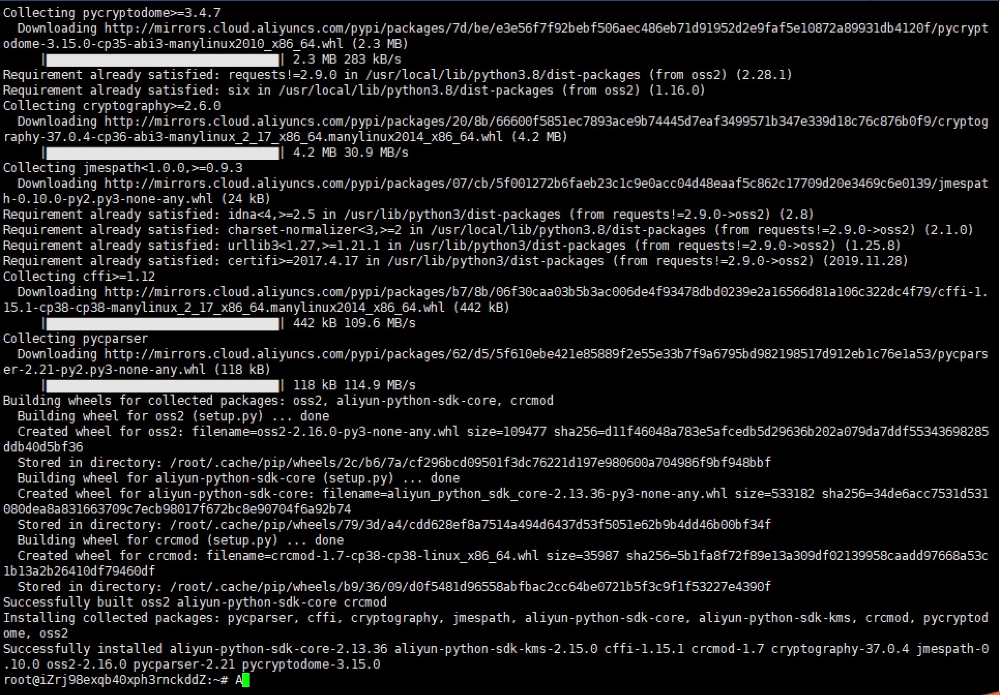

Enter the command vim test.py to create a script file named "test.py" and copy the following content to the file. Replace YOUR-ACCESS-KEY-ID and YOUR-ACCESS-KEY-SECRET with the AccessKey ID and AccessKey secret that you created. Replace YOUR-BUCKET-NAME with the bucket name that you recorded and replace YOUR-KMS-ID with the key ID that you recorded

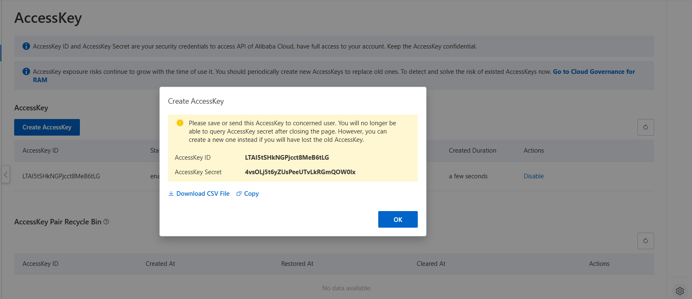

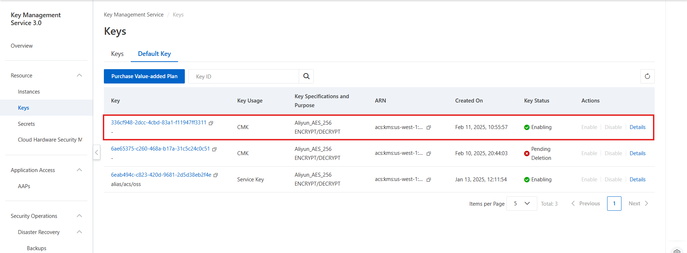

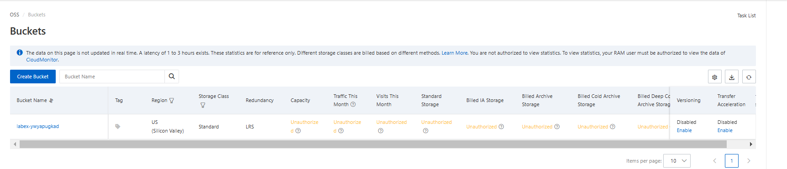

```python
# -*- coding: utf-8 -*-
import os
import sys
import oss2
from  oss2.crypto import AliKMSProvider

accessKeyId = "YOUR-ACCESS-KEY-ID"
accessKeySecret = "YOUR-ACCESS-KEY-SECRET"
bucketName = "YOUR-BUCKET-NAME"
keyId = "YOUR-KMS-ID"

def auth():
    kms_provider=AliKMSProvider(accessKeyId, accessKeySecret, 'us-west-1', keyId)
    bucket = oss2.CryptoBucket(oss2.Auth(accessKeyId, accessKeySecret), 'oss-us-west-1-internal.aliyuncs.com', bucketName, crypto_provider = kms_provider)
    return bucket

def upload(filename):
    bucket = auth()
    with open(filename, "rb") as fp:
        content = fp.read()
    print(content)
    bucket.put_object(filename, content, headers={'content-length': str(1024 * 1024)})

def download(filename):
    bucket = auth()
    result = bucket.get_object_to_file(filename, "result.txt");
    with open("result.txt", "rb") as fp:
        content = fp.read()
    print(content)

if __name__ == "__main__":
    if len(sys.argv) != 3:
        print("args is not correct")
        exit(1)
    if sys.argv[1] == "download":
        download(sys.argv[2])
        print("download success\n")
    if sys.argv[1] == "upload":
        upload(sys.argv[2])
        print("upload success\n")
```

Run the following command to create a data file named "data.txt" and add content to the file.

```bash
echo "1234567890" > data.txt

cat data.txt
```

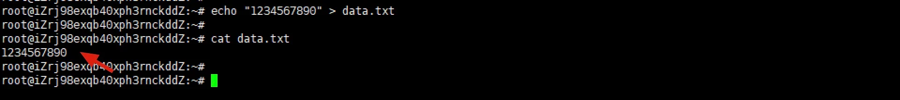

After the command is executed, go to the OSS console, and then go to the bucket.

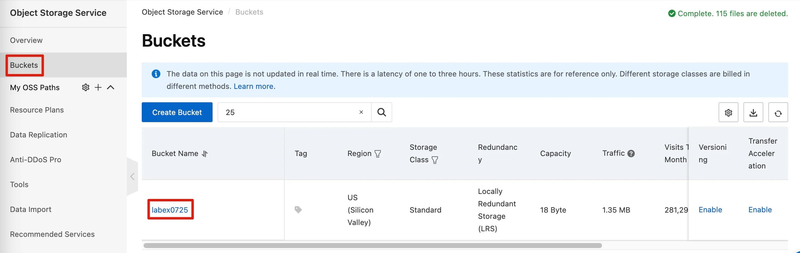

In the OSS console, the bucket that is uploaded is displayed.

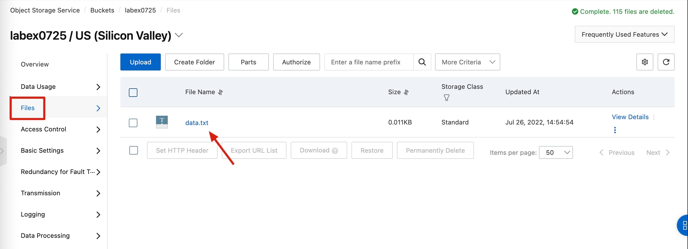

Download the object and open the object on your local computer.

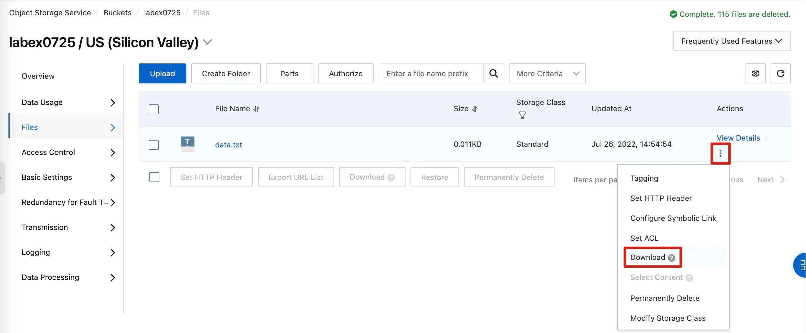

Go to the CLI of the ECS instance and run the following command to download the file, and then save the file as "result.txt":

```bash
python3 test.py download data.txt
```

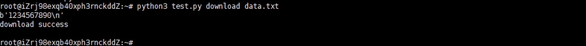

Run the following command to view the content of the "result.txt" file: The content in the "result.txt" file is the same as the content in the "data.txt". This indicates that the object is decrypted during the download process.

```bash
cat result.txt
```

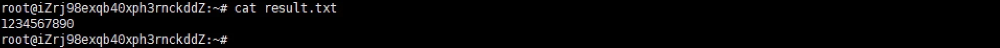

### Server-side encryption

OSS supports server-side encryption. When you upload an object to a bucket for which server-side encryption is enabled, OSS encrypts and then stores the object. When you download an encrypted object, OSS decrypts the object, and then returns the decrypted object. A header is added to the response to indicate that the object is encrypted on the OSS server.

The following table describes the server-side encryption methods that can be used in different scenarios.

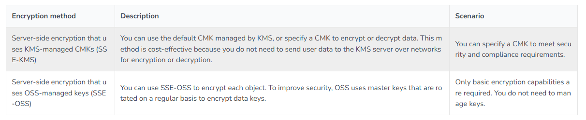

You can use a CMK managed by KMS to generate data keys for object encryption. KMS eliminates the need to manually maintain the security, integrity, and availability of your keys. You need to focus on only data encryption, data decryption, and digital signature generation and digital signature verification of your business.

The following figure shows the logic of server-side encryption based on SSE-KMS.

#### Configure server-side encryption

Go to the OSS console, as shown in the following figure.

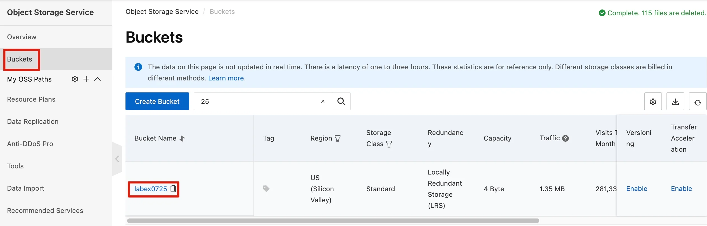

Select Server-side Encryption, and click Settings.

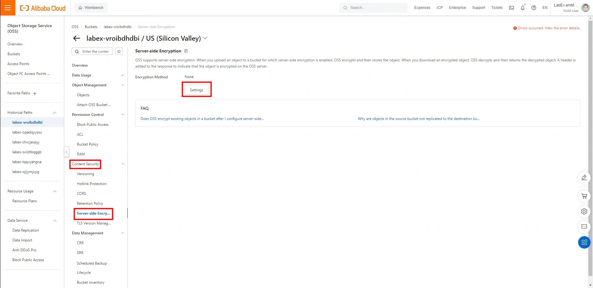

Select KMS as the encryption method, and click Save.

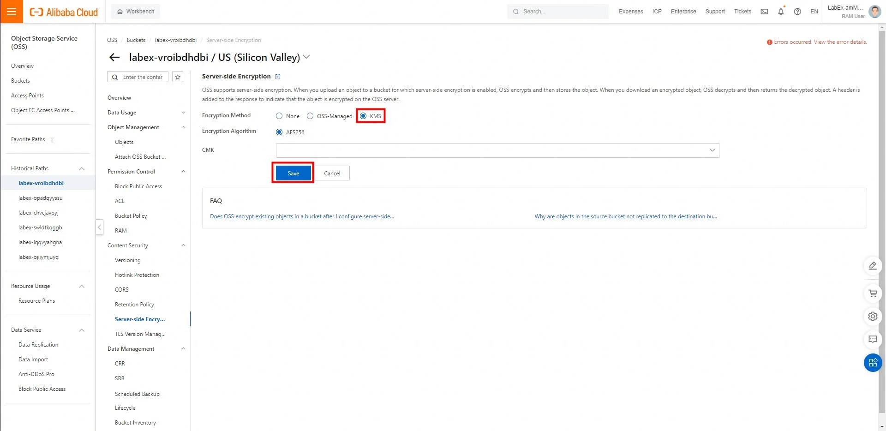

OSS encrypts only objects that are uploaded after server-side encryption is configured for a bucket and does not encrypt existing objects in the bucket. If you want to encrypt existing objects in the bucket, you can call the CopyObject operation to overwrite the existing objects.

#### Perform encryption tests and decryption tests

Run the vim test-server.py command to create a script file and copy the following content to the file. Replace YOUR-ACCESS-KEY-ID and YOUR-ACCESS-KEY-SECRET with the AccessKey ID and AccessKey secret that you created. Replace YOUR-BUCKET-NAME with the bucket name that you recorded.

```python
# -*- coding: utf-8 -*-
import os
import sys
import oss2

accessKeyId = "YOUR-ACCESS-KEY-ID"
accessKeySecret = "YOUR-ACCESS-KEY-SECRET"
bucketName = "YOUR-BUCKET-NAME"

def auth():
    auth = oss2.Auth(accessKeyId, accessKeySecret)
    bucket = oss2.Bucket(auth, 'oss-us-west-1-internal.aliyuncs.com', bucketName)
    return bucket

def upload(filename):
    bucket = auth()
    bucket.put_object_from_file(filename, filename)


def download(filename):
    bucket = auth()
    result = bucket.get_object_to_file(filename, "result2.txt");

if __name__ == "__main__":
    if len(sys.argv) != 3:
        print("args is not correct")
        exit(1)
    if sys.argv[1] == "download":
        download(sys.argv[2])
        print("download success\n")
    if sys.argv[1] == "upload":
        upload(sys.argv[2])
        print("upload success\n")
```

Run the following command to upload the "result.txt" file that you created in section 3.6 to the bucket:

```bash
python3 test-server.py upload result.txt
```

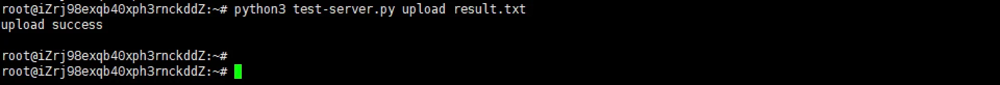

Go to the OSS console to view that the object is uploaded.


View details of the object. If a value except for None is displayed next to the Server-side Encryption parameter, the object is encrypted.

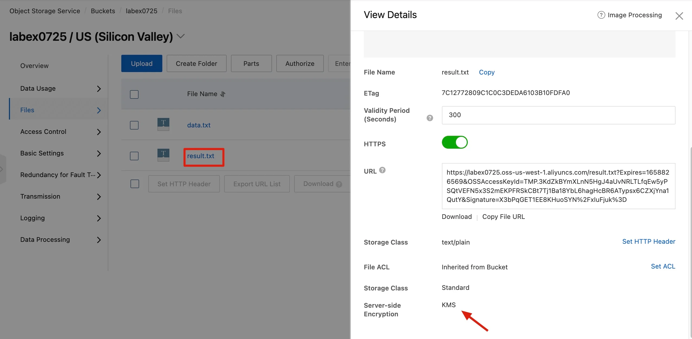

Go to the CLI of the ECS instance and run the following command to download the "result.txt" object. Then, save the file as "result2.txt".

```bash
python3 test-server.py download result.txt
```

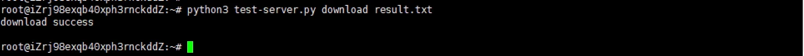

Run the following command. You can view that the content is automatically decrypted when the object is downloaded.

```bash
cat result2.txt
```

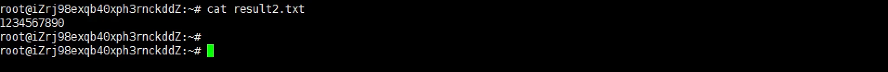

When you download an encrypted object, the RAM user that is used must be granted KMS-related permissions to decrypt the object. If the RAM user is not granted KMS-related permissions, the object cannot be decrypted and downloaded. The KMS-related permissions are granted to the RAM user when the lab is started. This way, the object is automatically encrypted when the object is uploaded and the object is automatically decrypted when the object is downloaded.

For information about the permissions that are required by [RAM users](https://help.aliyun.com/document_detail/31871.html) to use server-side encryption in different scenarios
